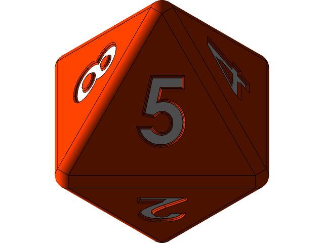

<!-- PROJECT LOGO -->
<br />
<div align="center">
  <a href="https://github.com/0xJayPi/give-me-7">
    
  </a>

  <h3 align="center">Give Me SEVEN!!</h3>

  <p align="center">
    Proof of Concept for an Upgradeable Proxy
  </p>
</div>

# Summary

A game where you need to send ETH every time you want to roll the dice. If you get a 7, you win the prize in ETH. Otherwise, your ETH acummulates for another lucky player.

I made this POC to show an Use Case for Upgradeable Proxies. First, we deploy v1 of the implementation (GiveMe7v1.sol) which has a high vulnerability bug related to the source of randomness. Hypothecialy, this bug was not detected during deployment. Hence, it was then addressed in v2 (GiveMe7v2.sol) by means of implementing a secure and decentralized source of randomness (Chainlink VRF).

Implementation v1 is based on the Dice challenge from the Speed Run Ethereum.

# Technical Details

## Considerations when using Upgradeable Proxies

* The constructor can't be used, we need and "initialization" function instead that is only used for the 1st implementation.
* The function is identified by the modifier ```initializer```.
* For the subsequent implementations, we cannot use this function. Different access control approaches have to be used.
* Storage collisions have to be considered between the different implementations. We can't modify the order of pre-existing variables.
* We have to be carefull about function clashes as well. Potentially, 2 functions could have the same signature. This issue is addressed by the Solidity compiler only when it happens within the same contract. Thus, it won't alert us when it happens between different implementations.

## Source of Randomness

* Blockchains are deterministics and, as such, they can't produce true randomness within their own context.
* Using on-chain information (e.g. block hash) to generate randomness is not secure. An attacker contract could execute the same logic at the same time and predict the resulting number.
* The best solution we have, as of today, is to a use decentralized source of randomness like Chainlink VRF, which can't be manipulated by any user, node operator, or malicious actor.

## Contracts Architecture

contracts/
* GiveMe7v1.sol: Implementation that has vulnerability associated with randomness.
* GiveMe7v2.sol: Implementation that solves vulnerability using Chainlink VRF.
* RiggedRoll.sol: Contract that is used to hack v1.

contracts/chainlink/
* VRFConsumerBaseV2Upgradeable.sol: VRF coordinator modified to be proxy compatible.

contracts/test/
* VRFCoordinatorV2Mock.sol: Mock to replicate behaivour of a Chailink VRF.

## Unit Testing

The test is divided in 3 steps:

1. Deploy implementation v1. 
2. Hack implementation v1. 
3. Upgrade to implementation v2.

## Potential next Upgrades

* Add a second dice and modify the patterns.
* Add different dices games.
* Build the frontend.

## Reference 

* [EIP1976](https://eips.ethereum.org/EIPS/eip-1967)
* [OpenZeppelin's Proxies](https://docs.openzeppelin.com/contracts/4.x/api/proxy)
* [OpenZeppelin's Writing Upgradeable Contracts](https://docs.openzeppelin.com/upgrades-plugins/1.x/writing-upgradeable)
* [Chainlikn VRF](https://docs.chain.link/vrf/v2/introduction/)
* [Speed Run Ethereum, Dice Challenge](https://speedrunethereum.com/challenge/dice-game)

## Sample Contract in Goerli

Proxy: 0x360d94a879B3357304EE132212C377574737E2E5

# Getting Started

## Requirements

- [Nodejs](https://nodejs.org/en/)
  - You'll know you've installed nodejs right if you can run:
    - `node --version` and get an ouput like `vx.x.x`
- [Yarn](https://classic.yarnpkg.com/lang/en/docs/install/) instead of `npm`
  - You'll know you've installed yarn right if you can run:
    - `yarn --version` And get an output like `x.x.x`

## Tech Stack

[](https://docs.soliditylang.org/en/v0.8.17/)
[](https://developer.mozilla.org/en-US/docs/Web/JavaScript)
[](https://hardhat.org/docs)
[](https://docs.openzeppelin.com)
[](https://docs.chain.link/ethereum/)

## Hardhat Setup

* Run ```yarn add --dev @nomiclabs/hardhat-ethers@npm:hardhat-deploy-ethers ethers @nomiclabs/hardhat-etherscan @nomiclabs/hardhat-waffle chai ethereum-waffle hardhat hardhat-deploy hardhat-gas-reporter prettier prettier-plugin-solidity solidity-coverage dotenv @openzeppelin/hardhat-upgrades @openzeppelin/contracts @openzeppelin/contracts-upgradeable @chainlink/contracts```.
* Add/copy .gitignore, .prettierrc, .prettierignore, README.md, hardhat-config.js, helper-hardhat-config.js
* Fill the .env file (see Deploy to a Testnet or Mainnet).

# Usage

## Deploy to Hardhat

Initiate the local node, which already deploys contracts when initiated:
```
hh node --network hardhat
```
If needed to deploy again:
```
hh deploy --reset
```
Run tests:
```
hh test
```

## Deploy to a Testnet or Mainnet

1. Setup environment variabltes

You'll want to set below parameters in your `.env` file.

* `PRIVATE_KEY`: The private key of your account.
* `MAINNET_RPC_URL`: This is url of the mainnet node you're working with.
* `GOERLI_RPC_URL`: This is url of the goerli testnet node you're working with.
* `ETHERSCAN_API_KEY`: This is the KEY you generate from etherscan.io. To be used to verify the contracts on testnet and mainnet.
* `COINMARKETCAP_API_KEY`: This is the KEY you generate from coinmarketcap.com. To be used to do quick USD calculations for gas usage.

2. Get testnet ETH

Head over to [goerlifaucet.com/](https://goerlifaucet.com/) and get some tesnet ETH. 

3. Deploy

```
hh deploy --network goerli --tags proxy
```

## Verify on Etherscan

If you deploy to a testnet or mainnet, you can verify it if you get an [API Key](https://etherscan.io/myapikey) from Etherscan and set it as an environemnt variable named `ETHERSCAN_API_KEY`. 

In it's current state, if you have your api key set, it will auto verify goerli contracts!

However, you can manual verify with:

```
hh verify --constructor-args arguments DEPLOYED_CONTRACT_ADDRESS
```
See [Verifying your contracts](https://hardhat.org/hardhat-runner/docs/guides/verifying) for updated information.

# Thank you!

[](https://www.linkedin.com/in/jpcampaya/)
[](https://twitter.com/0xJayPi)
